# Research Paper Scorer

A Python library for extracting text from research papers (PDFs) and scoring them using Claude AI models.

## Features

- **PDF Text Extraction**: Extract text from research papers with intelligent section detection
- **Smart Chunking**: Automatically split papers into logical sections (Abstract, Introduction, Methods, etc.)
- **AI-Powered Scoring**: Use Claude Haiku 3.5 to evaluate each section and generate quality scores
- **Contextual Memory**: Sections are scored with awareness of previous sections to prevent penalizing for "missing" information
- **Section Summaries**: Generate concise summaries of each section to build context for subsequent evaluations
- **Detailed Markdown Reports**: Automatically generate comprehensive analysis reports for each paper
- **Batch Processing**: Score multiple papers at once with summary reports
- **CLI Interface**: Easy-to-use command-line interface
- **Customizable**: Configure scoring prompts and processing parameters

## Installation

1. Clone this repository:
```bash
git clone <repository-url>
cd research-paper-score/src-code
```

2. Install dependencies:
```bash
pip install -r requirements.txt
```

3. Set up your environment:
```bash
cp .env.example .env
# Edit .env and add your ANTHROPIC_API_KEY
```

## Quick Start

### Python API

```python
from research_scorer import PaperScorer

# Initialize with your API key (markdown export enabled by default)
scorer = PaperScorer(
    api_key="your_anthropic_api_key",
    save_detailed_results=True,  # Creates detailed markdown reports
    results_dir="results",       # Directory for markdown files
    use_context=True             # Enable contextual memory (default)
)

# Score a single paper - automatically creates markdown report
result = scorer.score_paper("papers/research_paper.pdf")

print(f"Average Score: {result.average_score:.2f}")
print(f"Sections Evaluated: {result.total_chunks}")

# View section-by-section scores
for chunk_score in result.chunk_scores:
    print(f"{chunk_score.section_name}: {chunk_score.score:.1f}")

# Batch process multiple papers with individual + summary reports
results = scorer.batch_process_with_markdown([
    "papers/paper1.pdf",
    "papers/paper2.pdf"
])
```

### Command Line Interface

Score a single paper with contextual memory:
```bash
python -m research_scorer.cli score papers/research_paper.pdf --verbose --use-context
```

Score all papers in a directory with detailed reports:
```bash
python -m research_scorer.cli batch papers/ --save-markdown --use-context --results-dir results
```

Disable contextual memory (independent section scoring):
```bash
python -m research_scorer.cli score papers/paper.pdf --no-use-context
```

Disable markdown export (JSON only):
```bash
python -m research_scorer.cli score papers/paper.pdf --no-save-markdown --output results.json
```

## Architecture & Flow

### System Flow Diagram

```mermaid
graph TD
    A[📄 PDF Input] --> B[PDFProcessor]
    B --> C[Text Extraction]
    C --> D[Section Detection]
    D --> E[TextChunker]
    E --> F[Split Large Chunks]
    F --> G[Filter Small/Reference Chunks]
    G --> H[ClaudeScorer]
    H --> I{Use Context?}
    I -->|Yes| J[Score with Previous Section Summaries]
    I -->|No| K[Score Independently]
    J --> L[Generate Section Summary]
    K --> L
    L --> M[Store Summary for Context]
    M --> N{More Chunks?}
    N -->|Yes| H
    N -->|No| O[PaperScorer]
    O --> P[Calculate Average Score]
    P --> Q[Generate Results]
    Q --> R{Save Markdown?}
    R -->|Yes| S[📊 Detailed Markdown Report]
    R -->|No| T[📋 JSON Results]
    S --> U[📁 Results Directory]
    T --> U
```



### Processing Pipeline

The Research Paper Scorer follows a systematic pipeline:

1. **📄 PDF Input** → **PDFProcessor**
   - Extracts raw text using PyMuPDF
   - Detects research paper sections (Abstract, Introduction, Methods, etc.)
   - Creates initial text chunks by section

2. **📝 Text Processing** → **TextChunker**
   - Splits large sections into manageable chunks (<4000 chars)
   - Filters out reference sections and figure/table heavy content
   - Maintains section context and metadata

3. **🤖 AI Scoring** → **ClaudeScorer**
   - Scores each chunk using Claude 3.5 Haiku
   - Builds contextual memory from previous section summaries
   - Generates detailed reasoning and section summaries

4. **📊 Results Generation** → **PaperScorer**
   - Calculates overall paper score from section scores
   - Creates comprehensive markdown reports with visual elements
   - Supports batch processing with summary reports

### Core Components

#### PaperScorer (`paper_scorer.py:14`)
Main orchestrator that coordinates the entire scoring pipeline and manages configuration.

#### PDFProcessor (`pdf_processor.py:11`)
Extracts text from PDFs and detects research paper sections using pattern matching.

#### TextChunker (`text_chunker.py:8`)
Splits text into manageable chunks, filtering out references and low-content sections.

#### ClaudeScorer (`claude_scorer.py:11`)
Integrates with Anthropic's Claude API to score text chunks with contextual awareness.

## Scoring Criteria

The default scoring system evaluates papers on:

1. **Clarity and Writing Quality** (1-2 points)
2. **Technical Depth** (1-2 points)
3. **Novelty and Originality** (1-2 points)
4. **Methodology Rigor** (1-2 points)
5. **Evidence and Support** (1-2 points)

**Score Ranges:**
- 9-10: Exceptional quality, top-tier publication ready
- 7-8: Good quality, minor revisions needed
- 5-6: Average quality, significant improvements needed
- 3-4: Below average, major issues present
- 1-2: Poor quality, substantial problems

## Configuration

You can customize the scoring process:

```python
scorer = PaperScorer(
    api_key="your_key",
    model="claude-3-5-haiku-20241022",
    max_chunk_size=4000,
    min_chunk_size=100,
    delay_between_requests=1.0,
    use_context=True  # Enable/disable contextual memory
)

# Use custom scoring prompt
custom_prompt = "Your custom evaluation criteria..."
result = scorer.score_paper("paper.pdf", system_prompt=custom_prompt)
```

## How Contextual Memory Works

The library builds context as it processes each section:

1. **Section Analysis**: Each section is scored and summarized
2. **Memory Building**: Summaries are stored as context for future sections
3. **Contextual Scoring**: Later sections are evaluated with awareness of previous content
4. **Improved Accuracy**: Prevents penalizing sections for information covered elsewhere

**Example Context Flow:**
- Abstract → Summary: "Paper proposes new transformer architecture..."
- Introduction → Uses Abstract context → Summary: "Motivates need for efficiency..."
- Methods → Uses Abstract + Introduction context → More accurate scoring

## Example Output

### JSON Results
```json
{
  "paper_path": "papers/research_paper.pdf",
  "average_score": 7.2,
  "total_chunks": 6,
  "processing_time": 45.3,
  "chunk_scores": [
    {
      "section_name": "Abstract",
      "score": 8.0,
      "reasoning": "Clear and well-structured abstract..."
    }
  ]
}
```

### Markdown Reports
Each paper generates a comprehensive markdown report (`results/paper_analysis_TIMESTAMP.md`) containing:

- **Summary Table**: Overall score, sections analyzed, processing time
- **Score Distribution**: Visual score bars for each section  
- **Detailed Analysis**: Section-by-section evaluation with reasoning
- **Section Summaries**: Key points extracted from each section for context building
- **Full Text Content**: Collapsible sections with original text
- **Technical Details**: Processing configuration and metadata

**Batch Processing** also creates a summary report with score distributions and comparative analysis.

## Requirements

- Python 3.8+
- Anthropic API key
- PyMuPDF for PDF processing
- Click for CLI interface

## Error Handling

The library includes comprehensive error handling for:
- Invalid PDF files
- API rate limiting
- Network issues
- Malformed responses

Failed sections receive a score of 0 with error details in the reasoning field.

## Contributing

1. Fork the repository
2. Create a feature branch
3. Add tests for new functionality
4. Submit a pull request

## License

MIT License - see LICENSE file for details.